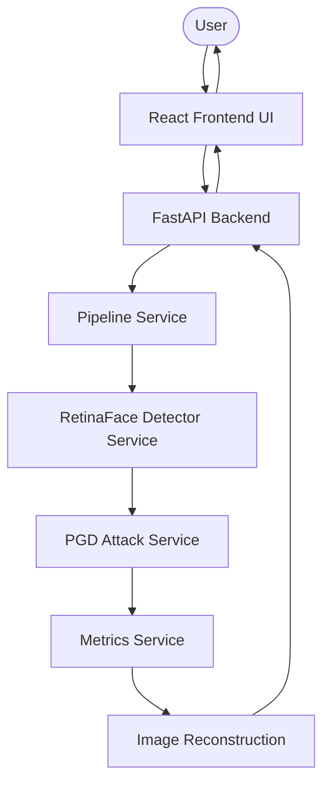

<div align="center">
  <h1>🛡️ Adversarial Image Cloaking</h1>
  <p><b>Advanced Privacy Defense Against Unauthorized Facial Recognition & Deepfake Generation</b></p>
  
  <p>
    <a href="https://github.com/shubham-atram/Adversarial-Image-Cloaking/releases/tag/v2.0.0"></a>
    <a href="https://python.org"></a>
    <a href="https://pytorch.org/"></a>
    <a href="https://fastapi.tiangolo.com/"></a>
    <a href="https://react.dev/"></a>
    <a href="https://github.com/shubham-atram/Adversarial-Image-Cloaking/blob/main/LICENSE"></a>
  </p>
</div>

---

## 📖 Project Overview

**Adversarial Image Cloaking** is an open‑source research platform that applies *adversarial perturbations* to facial images so that state‑of‑the‑art computer‑vision models (face detectors, deep‑fake generators, facial‑embedding extractors) fail to recognize the face, while the visual appearance to humans remains unchanged. The project targets **AI‑driven privacy threats** such as:
* Unauthorized facial‑recognition scraping
* Large‑scale image harvesting for training facial‑recognition systems
* Deep‑fake generation pipelines

The core contribution is a **full‑stack** system that combines a **RetinaFace** detector, a **Projected Gradient Descent (PGD)** attack, and a modular **FastAPI** backend with a **React + Vite** frontend.

> **Note** – The legacy implementation (MTCNN detector + FGSM attack) is kept in `src/ml_core/legacy` for reproducibility but is **not** part of the active pipeline.

---

## 🚀 What’s New in Version 2.0.0

| Feature | Description |
|---|---|
| **RetinaFace Detector** | Replaces the older MTCNN detector with a modern, multi‑scale FPN‑based model that is far more robust to occlusion and small faces. |
| **PGD Adversarial Attack** | Implements iterative Projected Gradient Descent (10 steps) for stronger, controllable perturbations compared to FGSM. |
| **Service‑Oriented Backend** | FastAPI routes are thin; all heavy lifting lives in a dedicated `pipeline_service`. Models are loaded once via a singleton `ModelRegistry`. |
| **Modular Architecture** | Separate services for detection, attack, metrics, and pipeline orchestration. |
| **React + Vite Frontend** | TypeScript‑based UI with Tailwind CSS & Vite for fast development and production builds. |
| **Improved Testing** | Comprehensive pytest suite covering end‑to‑end pipeline, model loading, and API contract. |
| **Documentation Overhaul** | All sections now reflect the current codebase, including updated architecture diagrams and usage examples. |
| **Legacy Module Separation** | Legacy MTCNN/FGSM code lives under `src/ml_core/legacy` and is clearly marked as *legacy*. |

---

## 📦 Technology Stack

| Layer | Technologies |
|---|---|
| **Frontend** | React, Vite, TypeScript, Tailwind CSS |
| **Backend** | FastAPI, Python 3.11+, Pydantic, Uvicorn |
| **Machine Learning** | PyTorch, OpenCV, NumPy, RetinaFace (TensorFlow/Keras backend) |
| **Legacy** | MTCNN, FGSM (kept for reference) |
| **DevOps** | Git, GitHub, Pytest, npm, VS Code |

---

## 🏛️ System Architecture



---

## 🔬 Machine Learning Pipeline

```text
Input Image
   ↓
Decode (cv2.imdecode) → RGB NumPy array
   ↓
Face Detection (RetinaFace) → crop + bounding box
   ↓
Tensor Preparation (normalize, resize) → Face tensor
   ↓
PGD Attack → Adversarial face RGB array
   ↓
Reconstruction (paste adversarial face back)
   ↓
Metrics (SSIM, PSNR)
   ↓
Encode (JPEG → Base64)
   ↓
Cloaked Image (Base64) + metrics returned to client
```

---

## 📂 Project Structure

```
AntiDeepfake/
├── src/
│   ├── backend/               # FastAPI application
│   │   ├── main.py
│   │   ├── core/               # config & model registry
│   │   ├── routes/             # API routers (cloak endpoint)
│   │   ├── schemas/            # Pydantic models (request/response)
│   │   └── services/           # detector, attack, metrics, pipeline
│   ├── frontend/               # React + Vite UI
│   │   ├── package.json
│   │   ├── vite.config.ts
│   │   ├── tailwind.config.js
│   │   └── src/                # components, pages, hooks, services
│   └── ml_core/                # ML core library
│       ├── models/            # RetinaFace (new) & legacy models
│       ├── attacks/            # PGD (new) & legacy FGSM
│       ├── evaluation/         # Benchmark scripts
│       ├── utils/              # Image & tensor helpers
│       └── legacy/             # MTCNN & FGSM (deprecated)
├── tests/                     # pytest suite
├── docs/                      # Markdown docs, assets
├── data/                      # Sample images & test datasets
├── scripts/                   # Helper scripts (e.g., model download)
├── requirements.txt
├── package.json               # Root (mostly for CI scripts)
├── vite.config.*
├── tsconfig.*
└── README.md
```

---

## ⚙️ Installation Guide

### Prerequisites
* **Python 3.11+**
* **Node.js 18+** and **npm**
* **Git**

### 1️⃣ Backend & ML Core
```bash
# Clone the repo
git clone https://github.com/shubham-atram/Adversarial-Image-Cloaking.git
cd Adversarial-Image-Cloaking

# Create a virtual environment
python3 -m venv .venv
source .venv/bin/activate

# Install Python dependencies
pip install -r requirements.txt

# Start the FastAPI server (development mode)
uvicorn src.backend.main:app --host 0.0.0.0 --port 8000 --reload
```
*The server will download the RetinaFace weights on first run (≈ 30 MB).*

### 2️⃣ Frontend
```bash
# In a new terminal
cd src/frontend
npm install
npm run dev   # Vite dev server at http://localhost:5173
```

### 3️⃣ API Documentation
* Swagger UI: `http://localhost:8000/docs`
* ReDoc: `http://localhost:8000/redoc`

### 4️⃣ Running the Test Suite
```bash
# Ensure the virtual environment is active
pytest -q   # All tests should pass
```

---

## 📡 API Documentation

### POST `/api/v1/cloak`
* **Description** – Apply the PGD adversarial cloaking pipeline to an uploaded face image.
* **Request** – `multipart/form-data`
  ```
  file: <JPEG|PNG|BMP|WebP image>
  epsilon (optional, float, 0.0 < ε ≤ 1.0): perturbation budget (default = 0.02)
  ```
* **Response** – `application/json`
  ```json
  {
    "success": true,
    "processing_time_ms": 123.45,
    "metrics": {"ssim": 0.998765, "psnr": 48.12},
    "cloaked_image_base64": "<Base64‑encoded JPEG>"
  }
  ```
* **Error Codes**
  * `400` – Invalid image, unsupported MIME type, or no face detected.
  * `500` – Internal processing error (e.g., model failure).
  * `503` – Service unavailable (models not loaded).

---

## 🧪 Testing Workflow

* **Unit tests** live under `tests/` and cover:
  * Model registry loading (`registry.load()`)
  * Detector service (`detect_face`)
  * Attack service (`run_attack`)
  * End‑to‑end pipeline (`run_cloaking_pipeline`)
* Run tests with `pytest`. CI (GitHub Actions) runs the suite on every PR.

---

## 🗺️ Research Evolution Roadmap

| Version | Status | Face Detector | Adversarial Attack |
|---|---|---|---|
| **v1.0** | 🕰️ Legacy | MTCNN | FGSM |
| **v2.0** | ✅ Stable | **RetinaFace** | **PGD** |
| **v3.0** | 🚧 Planned | ResNet‑Based Detector | DeepFool / Carlini‑Wagner |
| **v4.0** | 🚧 Planned | InsightFace | Universal Adversarial Perturbations |

---

## 🔒 Security & Ethical Considerations

* **Zero Retention** – Uploaded images are processed entirely in memory; no files are written to disk or persisted.
* **Intended Use** – Defensive privacy research only. Not to be used for illicit evasion of lawful surveillance.
* **Limitations** – Perturbations are evaluated against RetinaFace and the PGD attack; future hardened models may defeat the current approach.
* **Responsible Disclosure** – Vulnerabilities discovered in the pipeline should be reported responsibly.

---

## 🤝 Contribution Guidelines

1. Fork the repository.
2. Create a feature branch (`git checkout -b feature/<name>`).
3. Add code & tests.
4. Run the full test suite (`pytest`).
5. Submit a Pull Request targeting the `develop` branch.
6. Ensure documentation changes accompany any new functionality.

---

## 📜 License

Distributed under the **MIT License**. See the `LICENSE` file for details.

---

<div align="center">

## 👥 Project Team

<b>Shubham Atram</b> — <b>Project Lead</b><br>
MANIT Bhopal | Integrated B.Tech + M.Tech in Mathematics and Data Science

<br>

<b>Yashika Gupta</b> — <b>Core Team Member</b><br>
MANIT Bhopal | B.Tech in Computer Science and Engineering

<br>

<p><i>Disclaimer: This project is provided for educational and research purposes only. Adversarial cloaking is a rapidly evolving field and does not guarantee absolute privacy against future AI models.</i></p>

</div>
