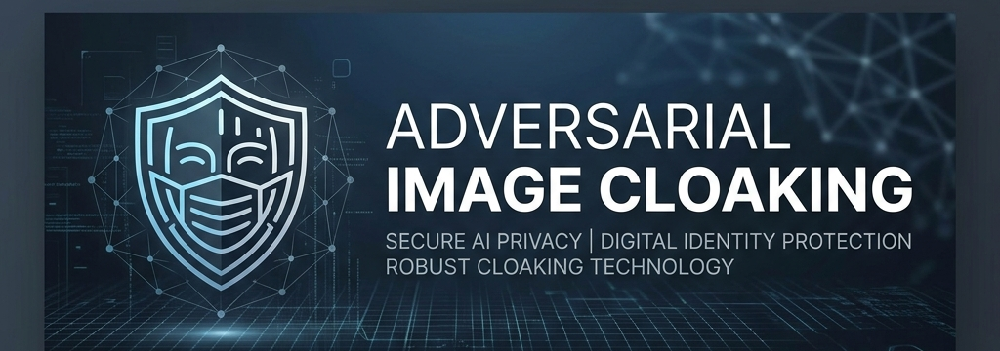
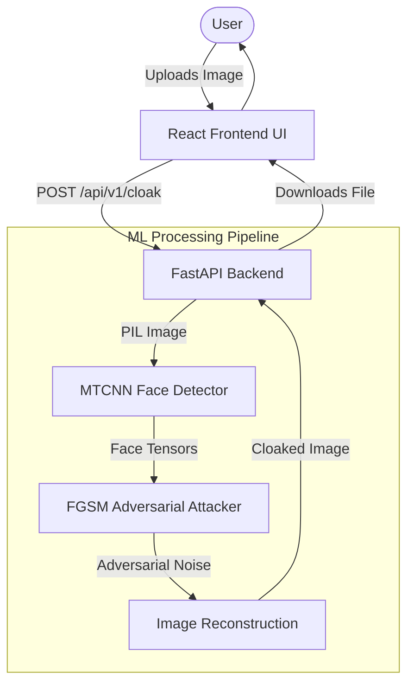

<p align="center">
  
</p>

<div align="center">
  <h1>🛡️ Adversarial Image Cloaking</h1>
  <p><b>Advanced Privacy Defense Against Unauthorized Facial Recognition & Deepfake Generation</b></p>
  
  <p>
    <a href="https://github.com/shubham-atram/Adversarial-Image-Cloaking"></a>
    <a href="https://python.org"></a>
    <a href="https://pytorch.org/"></a>
    <a href="https://fastapi.tiangolo.com/"></a>
    <a href="https://react.dev/"></a>
    
  </p>
</div>

---

## 📖 Table of Contents

1. [Project Overview](#project-overview)
2. [Problem Statement & Why It Matters](#problem-statement--why-it-matters)
3. [Key Features & Goals](#key-features--goals)
4. [System Architecture](#system-architecture)
5. [Technology Stack](#technology-stack)
6. [Research Objectives](#research-objectives)
7. [Machine Learning Pipeline](#machine-learning-pipeline)
8. [Project Structure](#project-structure)
9. [Installation Guide](#installation-guide)
10. [API Documentation](#api-documentation)
11. [Git Branch Strategy](#git-branch-strategy)
12. [Research Evolution Roadmap](#research-evolution-roadmap)
13. [Security & Ethical Considerations](#security--ethical-considerations)
14. [Skills Demonstrated](#skills-demonstrated)
15. [Current Release Status](#current-release-status)
16. [Contribution Guidelines](#contribution-guidelines)
17. [Author Information & License](#author-information--license)

---

## 🔍 Project Overview

**Adversarial Image Cloaking** is an AI Privacy and Cybersecurity research project. It mathematically perturbs facial images using **Adversarial Machine Learning** techniques to render them useless for AI training, deepfake synthesis, and facial embedding extraction—while maintaining human visual quality.

By applying **imperceptible gradient-based noise**, the cloaked image "tricks" computer vision systems into misclassifying or failing to detect the human face entirely.

### Problem Statement & Why It Matters

The proliferation of deepfake technology, unauthorized facial recognition systems, and large-scale image scraping for AI model training poses a severe threat to digital privacy. Traditional privacy measures, such as blurring or masking, render the image unusable for social sharing.

Defending against AI-driven privacy threats requires a proactive, cryptographic-like approach. Adversarial Image Cloaking fundamentally alters how deep learning models perceive images, effectively "cloaking" them from malicious AI without ruining the visual experience for human observers.

---

## ✨ Key Features & Goals

### Project Goals
* **Protect Digital Identities**: Prevent unauthorized AI exploitation of publicly shared personal images.
* **Advance AI Security**: Research and develop robust adversarial attacks against state-of-the-art computer vision models.
* **Provide Usable Privacy**: Deliver a scalable, user-friendly tool for individuals to cloak their images prior to online publication.

### Key Features
* **Imperceptible Protection**: Applies targeted adversarial noise that disrupts ML models without degrading visual quality.
* **End-to-End ML Pipeline**: Seamlessly integrates PyTorch face detection, FGSM adversarial attack generation, and image reconstruction.
* **Full-Stack Application**: Robust Python/FastAPI backend, React/Vite web interface, and a highly decoupled ML core.
* **Privacy by Design**: API processes all image tensors strictly in memory. Zero-retention policy for uploaded data.

---

## 🏛️ System Architecture

The project consists of three distinct, highly decoupled layers interacting through RESTful endpoints.



---

## 💻 Technology Stack

* **Frontend**: React, Vite, TypeScript, Tailwind CSS
* **Backend**: FastAPI, Python 3.11+, Pydantic, Uvicorn
* **Machine Learning**: PyTorch, OpenCV, NumPy, MTCNN
* **Development Tools**: Git, GitHub, VS Code, Pytest

---

## 🔬 Research Objectives

This project exists to address the escalating privacy risks associated with unauthorized data scraping and generative AI. The primary research questions explore the feasibility of applying mathematically sound adversarial perturbations to safeguard personal facial data without degrading human-perceivable visual quality.

Motivated by AI privacy concerns, the system is designed to provide individuals with proactive defensive mechanisms against identity harvesting. Our adversarial machine learning goals focus on identifying and exploiting the structural vulnerabilities within standard convolutional neural networks (CNNs) used for facial detection and recognition.

A key ongoing objective is to evaluate the **transferability** and **robustness** of these adversarial attacks—measuring how effectively a perturbation generated for one specific architecture (e.g., MTCNN) can evade detection by an entirely different, unseen architecture.

---

## 🔬 Machine Learning Pipeline

```text
Input Image
   ↓
Face Detection (MTCNN)
   ↓
Face Region Extraction
   ↓
FGSM Perturbation Generation
   ↓
Image Reconstruction
   ↓
Cloaked Image Output
```

1. **Input Image**: The system accepts a standard digital image from the user.
2. **Face Detection (MTCNN)**: The Multi-task Cascaded Convolutional Networks (MTCNN) architecture scans the input to identify bounding boxes representing human faces.
3. **Face Region Extraction**: The identified bounding box coordinates are used to isolate the facial tensor regions from the rest of the image.
4. **FGSM Perturbation Generation**: For the detected faces, the system calculates the gradient of the loss function with respect to the input pixels. The Fast Gradient Sign Method (FGSM) applies the sign of these gradients to compute a minimal, targeted perturbation ($\epsilon$) that maximizes the loss function of the target detection model.
5. **Image Reconstruction**: The generated adversarial noise is carefully blended back into the original image space.
6. **Cloaked Image Output**: The system outputs a reconstructed image that appears visually unchanged to humans but fundamentally disrupts facial detection architectures.

---

## 📂 Project Structure

```text
Adversarial-Image-Cloaking/
├── src/
│   ├── backend/           # FastAPI Application & API Routes
│   │   ├── main.py        # ASGI Entry Point
│   │   ├── routes/        # REST Endpoints
│   │   ├── services/      # Business Logic orchestration
│   │   └── schemas/       # Pydantic validation models
│   │
│   ├── frontend/          # React + Vite Web Application
│   │   ├── src/           # React Components, Hooks, API integration
│   │   ├── package.json   # NPM dependencies
│   │   └── tailwind.config.js # Styling configurations
│   │
│   └── ml_core/           # PyTorch Adversarial Pipeline
│       ├── models/        # MTCNN detector architectures
│       ├── attacks/       # FGSM and other adversarial attacks
│       ├── evaluation/    # Benchmarking and robustness tests
│       └── utils/         # Image & tensor transformations
│
├── tests/                 # Unit testing and adversarial validation scripts
├── data/                  # Sample images and benchmarking datasets
├── docs/                  # Project documentation and assets
└── requirements.txt       # Core Python dependencies
```

---

## 🚀 Installation Guide

### Prerequisites
* **Python 3.11+**
* **Node.js 18+**
* **NPM / Yarn**
* **Git**

### 1. Setup Backend & ML Core

```bash
# Clone the repository
git clone https://github.com/shubham-atram/Adversarial-Image-Cloaking.git
cd Adversarial-Image-Cloaking

# Create a virtual environment and activate it
python3 -m venv .venv
source .venv/bin/activate  # On Windows: .venv\Scripts\activate

# Install the dependencies
pip install -r requirements.txt

# Run the FastAPI server
python -m uvicorn src.backend.main:app --host 0.0.0.0 --port 8000 --reload
```

### 2. Setup Frontend

Open a new terminal session.

```bash
cd Adversarial-Image-Cloaking/src/frontend

# Install Node dependencies
npm install

# Start the Vite development server
npm run dev
```

Navigate to `http://localhost:5173` in your browser to interact with the UI.

---

## 🛠️ API Documentation

The FastAPI backend features auto-generated, interactive OpenAPI documentation. Once the backend server is running locally, navigate to:
* **Swagger UI**: `http://localhost:8000/docs`
* **ReDoc**: `http://localhost:8000/redoc`

### Example Workflow

```python
import requests

url = "http://localhost:8000/api/v1/cloak"
files = {"file": ("original_face.jpg", open("original_face.jpg", "rb"), "image/jpeg")}

response = requests.post(url, files=files)

if response.status_code == 200:
    with open("cloaked_face.jpg", "wb") as f:
        f.write(response.content)
    print("Successfully generated adversarially cloaked image.")
```

---

## 🌿 Git Branch Strategy

* `main`: Production-ready code, containing stable, verified releases.
* `develop`: Integration branch for aggregating upcoming features.
* `feature/*`: Feature-specific branches (e.g., `feature/ml-core`, `feature/backend-api`).
* `test/*`: Testing, validation, and adversarial red-teaming branches (e.g., `test/red-team`).

---

## 🗺️ Research Evolution Roadmap

These phases represent research milestones in a strict **Research Evolution Model**, not frontend/backend development stages. Each phase introduces a new generation of adversarial image cloaking techniques by pitting stronger attack methodologies against increasingly robust detection architectures.

### Version Comparison Table

| Version | Status | Face Detection Target | Adversarial Attack Strategy |
|---------|--------|----------------------|-----------------------------|
| **v1.0** | ✅ Completed | MTCNN | FGSM (Fast Gradient Sign Method) |
| **v2.0** | 🚧 Planned | RetinaFace | PGD (Projected Gradient Descent) |
| **v3.0** | 🚧 Planned | ResNet-Based Detector | DeepFool / Carlini-Wagner |
| **v4.0** | 🚧 Planned | InsightFace | Universal Adversarial Perturbations |

---

## 🛡️ Security & Ethical Considerations

* **Research Interpretation**: The outcomes of this project should be interpreted as research outcomes. Adversarial machine learning is an ongoing arms race, and effectiveness varies significantly by the target model.
* **Evasion Limitations**: There is no guarantee of perfect anonymity or absolute privacy. A cloaked image that evades MTCNN today may not defeat future, adversarially-trained robust models. Future models may be more resilient to current perturbation techniques.
* **Data Privacy (Zero Retention)**: The backend API processes images strictly in memory. No user images are logged, saved, or stored.
* **Ethical Use**: This project is engineered strictly for defensive privacy research. It must not be used to bypass legitimate security controls, anonymize illegal content, or subvert authorized law enforcement systems.

---

## 🧠 Skills Demonstrated

* **Machine Learning & AI**: Deep Learning, Adversarial Attacks, PyTorch, Computer Vision.
* **Cybersecurity**: AI Security, Privacy-Enhancing Technologies (PETs), Threat Modeling.
* **Software Engineering**: Full-Stack Development, RESTful API Design, React, FastAPI.
* **DevOps & Architecture**: Version Control, Agile Workflows, CI/CD Readiness.

---

## 🟢 Current Release Status

Version 1.0 represents the first complete implementation of the Adversarial Image Cloaking framework using MTCNN and FGSM.

| Component | Technology | Status |
|-----------|------------|--------|
| Face Detection | MTCNN | ✅ Implemented |
| Attack Method | FGSM | ✅ Implemented |
| Backend | FastAPI (Python) | ✅ Implemented |
| Frontend | React (Vite) | ✅ Implemented |
| ML Framework | PyTorch | ✅ Implemented |

---

## 🤝 Contribution Guidelines

Contributions are highly encouraged from AI researchers, cybersecurity engineers, and open-source developers. 
1. Open an issue to discuss proposed changes.
2. Create a feature branch (`git checkout -b feature/amazing-feature`)
3. Commit your changes (`git commit -m 'feat: add amazing feature'`)
4. Push to the branch (`git push origin feature/amazing-feature`)
5. Open a Pull Request targeting the `develop` branch.

---

<div align="center">
  <p>Distributed under the <b>MIT License</b>. See <code>LICENSE</code> for more information.</p>
  
  <p>Designed and developed by <b>Shubham Atram</b></p>
  <p>MANIT Bhopal | Integrated B.Tech + M.Tech in Mathematics and Data Science</p>
  
  <p><i>Disclaimer: This project is provided for educational and research purposes only. Adversarial cloaking is a rapidly evolving field and does not provide an absolute guarantee of digital privacy against all future AI models.</i></p>
</div>
